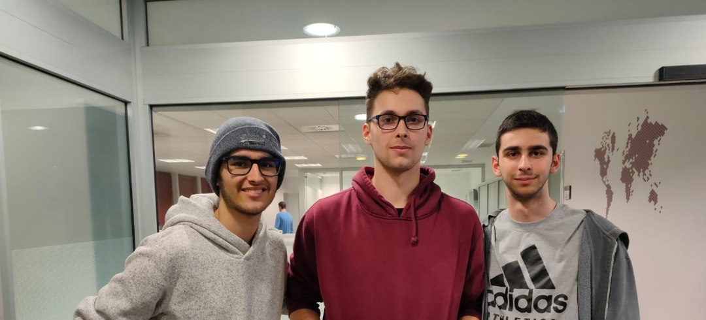

# Monk Studio
Monk Studio is an engine under development as the "Engine Development" subject project for the CITM in Video Game Design and Devolpment degree. 

Monk Studio is a fast C++ 3D game engine, focused on the Audio part of the engine.

## Collaboration with Rangar Engine

For this assignment and last deploy, we, the team of Monk Studio have forked from Rangar Engine pre-last release and implemented an Audio system.
[Ragnar Engine GitHub repository](https://github.com/UriKurae/Ragnar-Engine)

## Planning

The purpose of this project is to create a friendly-user, well optimized Game Engine for the subject "VideoGame Engines" from the 3rd year. The short term plan is to implement the basic features of a Game Engine, such as loading models, working in a 3D environment, etc...

More specifically, we want to develop a good Audio engine, capable of loading audios, edit multiple parameters and create effects with them.

# Creators

This engine was made by:
- Pol Vázquez Porcar: [GitHub: @AMADE128](https://github.com/Amade128): Audio Importer + Scene demo montage
- Himar Bravo González: [GitHub: @himar33](https://github.com/himar33): WWise Implementation + Audio Module
- Marc Pavon Llop: [GitHub: @Marckitus](https://github.com/Marckitus): OpenAL Implementation + Audio Effects

## Installation

The installation is pretty straight-forward and easy, just go into the [releases tab](https://github.com/AMADE128/MonkStudio/releases), and download the latest version.
The download files include an exe and you just have to execute it to use our engine.

**Careful**: You can edit the config file to modify some properties like the window and everything, but they come with an optimal configuration already.

## Controls

- Right click + WASD: Move the camera in it's own axis.
- Right click + Q/E: Move the camera up or down in it's own axis.
- Mouse scroll wheel: Move the camera forward and backwards in it's own axis.
- While selecting a GameObject and holding Alt + left click: Orbit the camera around the GameObject.
- While selecting a GameObject and pressing F: Focus the GameObject.
- Key T: Reset the camera (World axis reset).
- Left click GameObject on Scene or hierarchy: Select GameObject.
- Right click GameObject in the hierarchy: Open GameObject options.
- Supr while a GameObject is selected: Delete the GameObject.
- Supr while a resource is selected: Delete the resource.
- Hold left click in the hierarchy menu: Move GameObjects in the hierarchy (Reparenting).
- W,E,R buttons: show Move, Scale, Rotate guizmos. 
- Ctrl + N: Generate a new scene (You will be warned to save your current project).
- Ctrl + O: Opens the explorer window to search for a file and open it.
- Ctrl + S: Saves the current Scene.
- Ctrl + Shift + S: Opens the explorer window to save the scene in a desired location.
- Ctrl + D: Duplicates the selected game object.

- Play/Stop/Pause and Advance frame: To start a game preview, hit the play button, when you hit the play button, the preview will start, and the play button will be swapped by
the stop button. Hitting the stop button will stop the game preview.
Pause button will pause the game preview until you hit it again. When having the game in pause, you can advance one frame if you want. Also, the buttons and the whole engine will have different UI colors to let the user know that he is in game preview mode.

## Features

### v1.0

- Audio import, including the creation of .meta and audio files.
- Audio Mixer with allmost the same features as the Unity's audio mixer.
- Inspector to show all the properties of the audio.
- Camera is now set as the main Audio Listener.
- Audio effects.
- Properties of the audio (all editable).
- Play / Stop button.
- Mute and Loop button.
- You can drag and drop audio files, add them to GameObjects to convert the GameObject into audio sources (More than one audio file can be added to the same GameObject).

### v0.8

- Stencil border for the selected GameObject.
- Raycasting objects to select them (MousePicking).
- MousePicking detects the closest target that is hit.
- Resource manager that manages all kinds of resources, with a cool design.
  - All files are shown in the resource manager.
  - You can import any asset you need in it.
  - For better user experience, the resource has icons for models, folders, textures...
- Play/Stop/Pause and Advance next frame for game mode.
- Own file formats, hidden in the Engine's background.
  - They are saved as .rgtexture, .rgmesh and .rgmodel.
  - The scenes are saved as .ragnar.
  - The user will see the file formats as the ones he/she imported (png, jpg...).
- Selected GameObjects have Guizmos for better user experience.
- Imported texture and model options and filters (Alienify, flip UVs, Gaussian Blur...)
- Game clock and Engine clock.
- Quadtree implementation for better optimization.
- Camera system (Camera component, FOV, planes, etc...).
- Mini viewer to see what the game camera is looking at in the editor view.
  - Must have the camera selected, and it will be show in the bottom right corner of the editor viewport. 
- Different viewports (Editor View and Game View).
- Correct serialization and load methods for the engine.
- Frustum Culling for the cameras.
- AABB system for all the GameObjects.
- Shortcuts and explorer viewer for save, load and open files for better user experience.

### v0.5

- Camera movement (Rotate, Move, Orbit, Focus).
- Drag and drop textures and models.
- Load and save the configuration.
- GameObject and components system (Transform component, Mesh Renderer and Material Component).
- GameObject options (Rename, activate, move in the hierarchy, delete).
- Inspector information (Transform, mesh renderer, material).
- Own basic shapes (Pyramid, Sphere, Cube and Cylinder).
- Saving images to DDS for lower size.
- Beautiful and usable UX (provided by ImGui).
- Debug options for GameObjects (Normals, Normal length, Normal color, etc...).
- System information (Console, Hardware, Software, etc...).
- Opengl options (Wireframe Mode, Texture2D, Vsync, Stencil, etc...).
- Ability to close and reopen menus from the editor.

## User Interface

The menus are also very straight-forward, you can navigate through them and have multiple options for the engine itself, there are many options, so it's highly encouraged to test everything to understand the interface, **but keep in mind the following**:
- You can close any tab from the user interface, but don't worry, as you can re-open any window at any time.
- You can click and hold any tab to reallocate it anywhere you want.

## License

**Copyright (c) Pol Vázquez, Himar Bravo and Marc Pavon. License Under the MIT License.**

- [MIT License link to check more details about it.](https://opensource.org/licenses/MIT)
